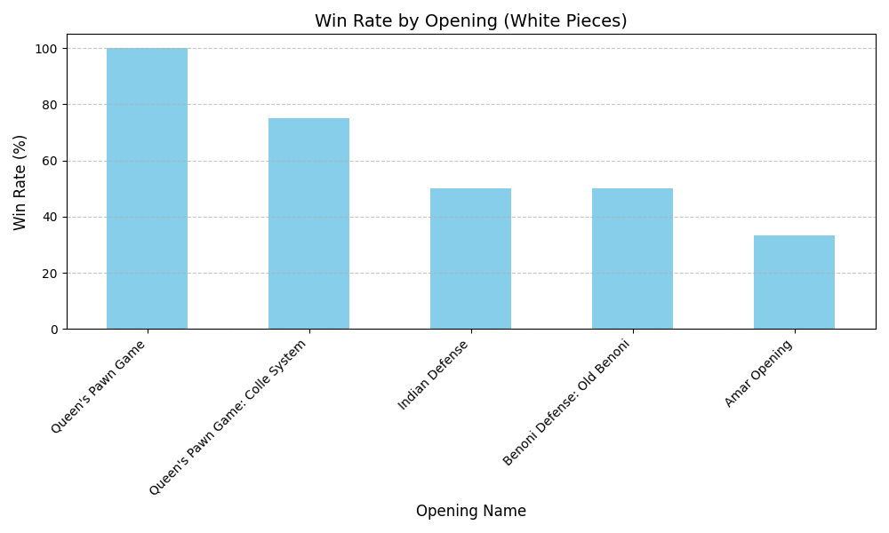

# Lichess Performance Analyzer

### This project is a Data Engineering and Analysis pipeline that connects to the lichess API to fetch a user's recent games, stores them in a local database and performs a statistical analysis of opening performance using Python, SQL and Pandas.

## Features:
Data Extraction: Connects to lichess API to retrieve games in PGN format. 
Custom ETL Pipeline: Parses raw PGN text into structured data (Opening, color, outcome).
Database Persistance: Stores processed games in a SQLite database for historical tracking.
Statistical Analysis: Uses Pandas to calculate win rates, draws, and losses per opening.
Data Visualization: Generates performance bar charts using Matplotlib.

## Tech Stack: 
Language: Python 3.13
Libraries: requests, pandas, sqlite3, matplotlib
Data Source: https://lichess.org/api

## Sample Output
The tool identifies which openings provide the best results for the player. For example:
Top Performer: Caro-Kann Defense (100% Win Rate)
Area for Improvement: Caro-Kann Defense: Breyer Variation (25% Win Rate)

## How to Use
Clone the repository.
Install dependencies: pip install requests pandas matplotlib.
Run the script: python main.py.
Enter your Lichess username when prompted.

## Future Roadmap & Improvements
This is the base version of the analyzer. Future iterations will focus on increasing data quality and depth:

Advanced Filtering: Implement a move-count threshold (e.g., > 10 moves) to exclude abandoned games or early disconnections that skew win rates.

Time Control Granularity: Filter analysis by game type (Blitz, Rapid, Classical) to see how performance varies under different time pressures. (e.g In bullet games the openings are not played very accurately.)

Opening Categorization: Resolve the "?" openings by cross-referencing Lichess ECO (Encyclopedia of Chess Openings) codes to ensure every game is correctly labeled.

Black Pieces Analysis: Expand the pipeline to include a dedicated performance report for games played with the Black pieces.

Automated Insights: Add a "Recommendation Engine" that suggests which openings to study based on the lowest win rates.

.
